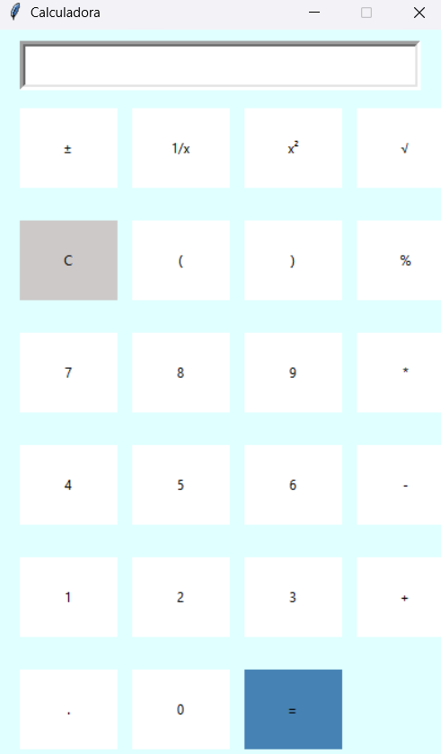

# Calculadora em Python com Tkinter


Este é um programa de calculadora gráfica desenvolvido em Python utilizando a biblioteca **Tkinter**. Ele suporta operações matemáticas básicas e avançadas.

## Funcionalidades

- **Operações básicas:** Adição, subtração, multiplicação e divisão.
- **Operações avançadas:** Números negativos, frações, potências, raízes quadradas e porcentagens.
- **Outras funcionalidades:** Limpar entrada, parênteses, ponto decimal e cálculo de expressões.

## Requisitos

- Python 3.x
- Tkinter (incluso no Python)

## Como executar

1. Salve o código em um arquivo chamado `calculadora.py`.
2. Execute o programa com o comando:

   ```bash
   python calculadora.py